# Tesseract Conversion from PDF's to HOCR . 


This bash script shows how to speed up tessearact in converting pdf documents to hocr format using gnu parallel.

### Requirements

The minimum prerequisites to run this sample are:
* Gnu parallel. To run the tesseract on multiple cores
* Imagemagic. To convert the pdf document to tiff image.
* Tesseract. To perform the conversion from tiff image to hocr format.

The simplest way to install the requirements are as follows: 
````Terminal
sudo apt-get install parallel
sudo apt-get install imagemagick
sudo apt-get install tesseract-ocr
````
2. Create the following folders

/mnt/sample_pdfs/
/mnt/tiff_folder/
/mnt/output_folder/ 2

Example

./pdfToHocr.sh /mnt/sample_pdfs/ /mnt/tiff_folder/ /mnt/output_folder/ 2

3. To view core utilization
sudo apt-get install htop

put the attachment from below.


        locationDialog.getLocation(session, options);
    },
    // ...
````

| Emulator | Facebook | Skype |
|----------|-------|----------|
|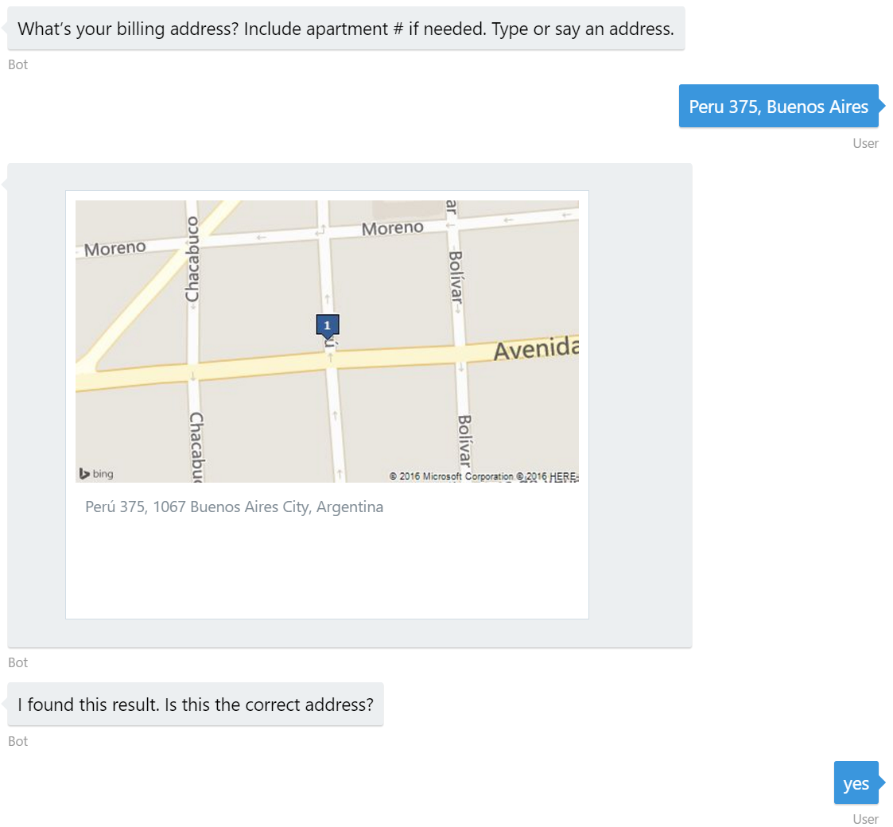|||

#### Rich Cards 

Many messaging channels provide the ability to attach richer objects. The Bot Framework has the ability to render rich cards as attachments.

The bot will render a Welcome message upon the first message or conversation start using a [HeroCard](https://docs.botframework.com/en-us/node/builder/chat-reference/classes/_botbuilder_d_.herocard) attachment within the [bot's root dialog](bot/index.js#L22-L36).

````JavaScript
var welcomeCard = new builder.HeroCard(session)
    .title('welcome_title')
    .subtitle('welcome_subtitle')
    .images([
        new builder.CardImage(session)
            .url('https://placeholdit.imgix.net/~text?txtsize=56&txt=Contoso%20Flowers&w=640&h=330')
            .alt('contoso_flowers')
    ])
    .buttons([
        builder.CardAction.imBack(session, session.gettext(MainOptions.Shop), MainOptions.Shop),
        builder.CardAction.imBack(session, session.gettext(MainOptions.Support), MainOptions.Support)
    ]);

session.send(new builder.Message(session)
    .addAttachment(welcomeCard));
````

| Emulator | Facebook | Skype |
|----------|-------|----------|
|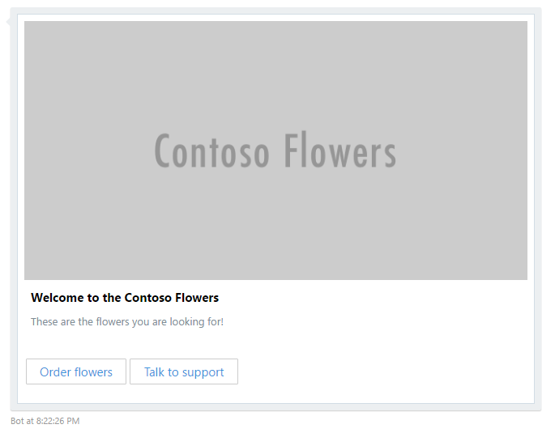|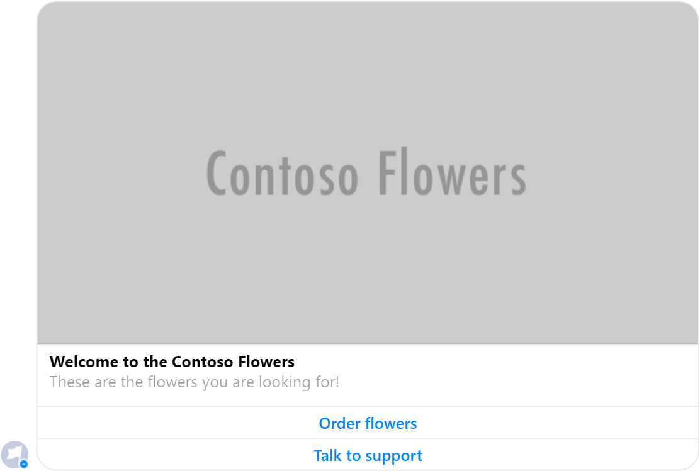|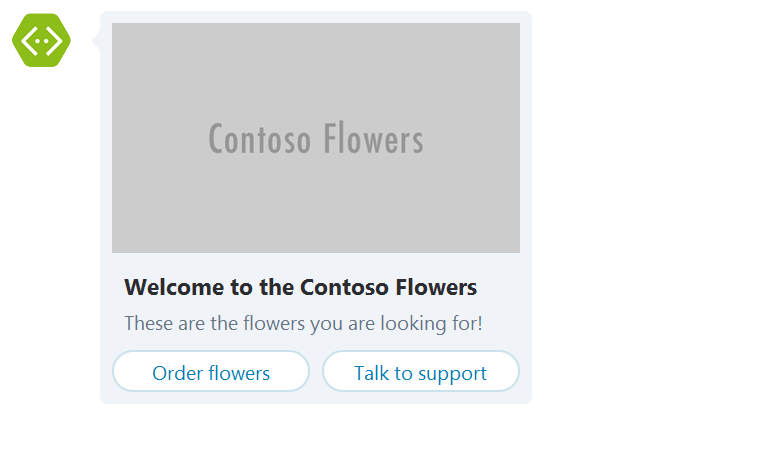|


Another example of rich card, is the ReceiptCard which renders differently depending on the messaging channel being supported. The receipt card is created in the [checkout's `completed` dialog](bot/dialogs/checkout.js#L73-L107) and is sent once the user completed the order payment.

````JavaScript
// Retrieve order and create ReceiptCard
orderService.retrieveOrder(orderId).then(function (order) {
    if (!order) {
        throw new Error(session.gettext('order_not_found'));
    }

    var messageText = session.gettext(
        'order_details',
        order.id,
        order.selection.name,
        order.details.recipient.firstName,
        order.details.recipient.lastName,
        order.details.note);

    var receiptCard = new builder.ReceiptCard(session)
        .title(order.paymentDetails.creditcardHolder)
        .facts([
            builder.Fact.create(session, order.id, 'order_number'),
            builder.Fact.create(session, offuscateNumber(order.paymentDetails.creditcardNumber), 'payment_method')
        ])
        .items([
            builder.ReceiptItem.create(session, order.selection.price, order.selection.name)
                .image(builder.CardImage.create(session, order.selection.imageUrl))
        ])
        .total(order.selection.price)
        .buttons([
            builder.CardAction.openUrl(session, 'https://dev.botframework.com/', 'more_information')
        ]);

    var message = new builder.Message(session)
        .text(messageText)
        .addAttachment(receiptCard);

    session.endDialog(message);
});
````

| Emulator | Facebook | Skype |
|----------|-------|----------|
|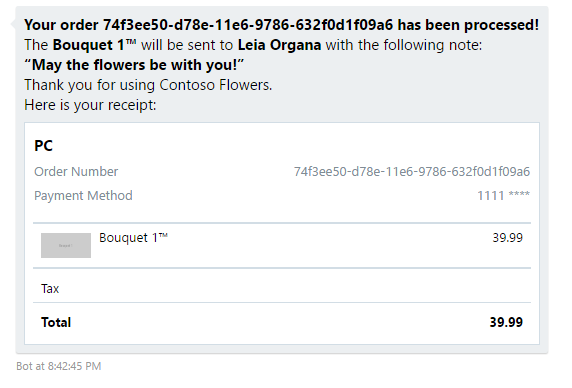|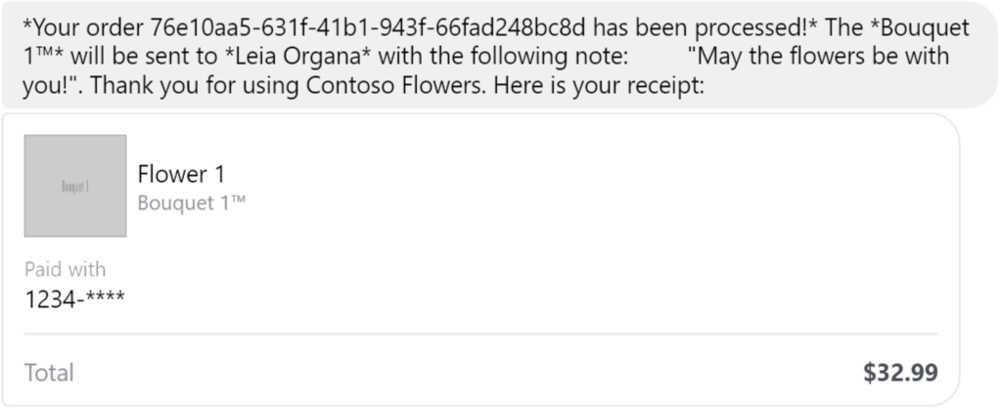|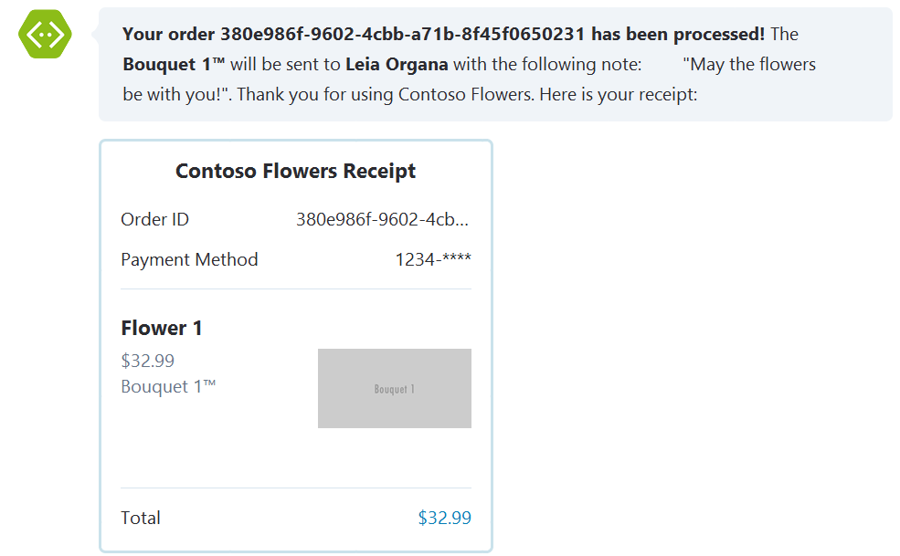|

> You can also see a full sample explaining the different types of rich cards in the [Rich Cards Bot Sample](../cards-RichCards).

#### Carousel of Cards

You can send multiple rich card attachments in a single message. On most channels they will be sent as a list of rich cards, but some channels (like Skype and Facebook) can render them as a carousel of rich cards.

Listing categories and product accompanied with a descriptive image is an example of how a Carousel of Cards can be used.

The [product-selection](bot/dialogs/product-selection.js#L27) dialog uses the [CarouselPagination](bot/dialogs/CarouselPagination.js) helper to create a dialog closure that displays a carousel of very rich cards.

This helper provides an easy way to display results to the user, handle pagination of results and validates user selection. Example usage:

````JavaScript
var Products = require('../services/products');
var CarouselPagination = require('./dialogs/CarouselPagination');
var DefaultCategory = 'Flower 2';

bot.dialog('/', [
    function (session, args, next) {
        // Create dialog function 
        var displayProducts = CarouselPagination.create(
            // getPageFunc(pageNumber: number, pageSize: number):Promise<PagingResult>
            function (pageNumber, pageSize) { return Products.getProducts(DefaultCategory, pageNumber, pageSize); },
            // getItemFunc(title: string):Promise<object>
            Products.getProduct,
            // itemToCardFunc(product: object):object
            function (product) {
                return {
                    title: product.name,
                    subtitle: '$ ' + product.price.toFixed(2),
                    imageUrl: product.imageUrl,
                    buttonLabel: 'Choose'
                };
            }),
            // settings
            {
                showMoreTitle: 'More items?',
                showMoreValue: 'Show me',
                selectTemplate: 'Select: ',
                pageSize: 5,
                unknownOption: 'I couldn\'t understand your selection. Please try again.'
            });

        // Invoke dialog function 
        // It  will handle product selection, pagination call or product list display 
        displayProducts(session, args, next);

    },
    function (session, args) {
        // Read selection
        var selectedProduct = args.selected;
        if (selectedProduct) {
            session.send('You selected "%s"', selectedProduct.name);
        }
    }
]);
````

| Emulator | Facebook | Skype |
|----------|-------|----------|
|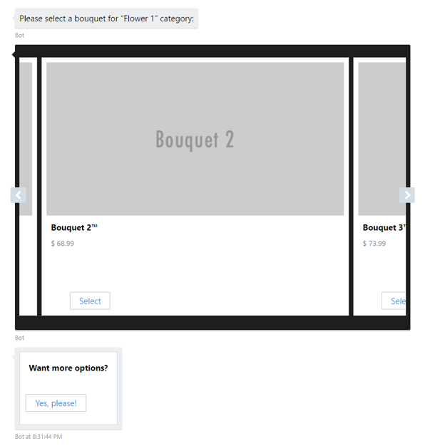|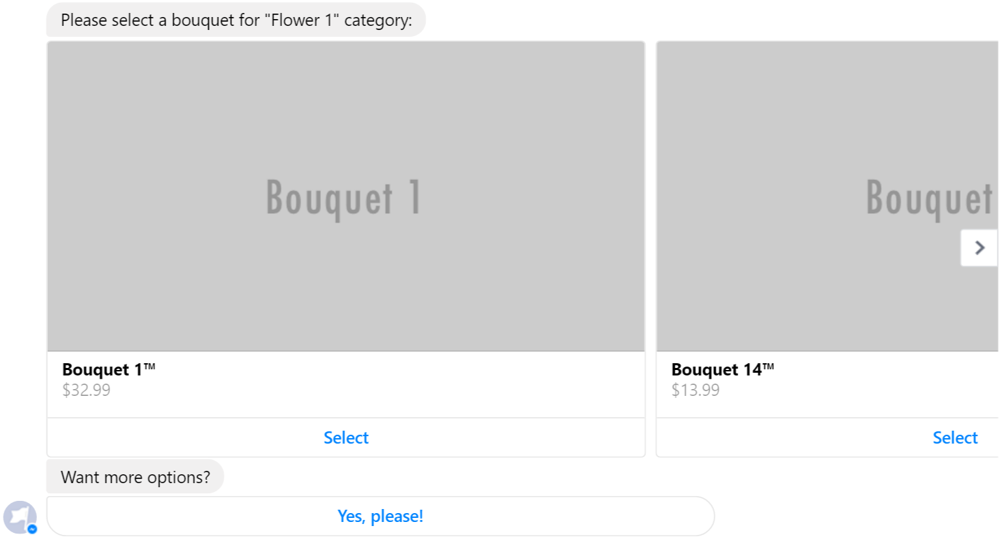|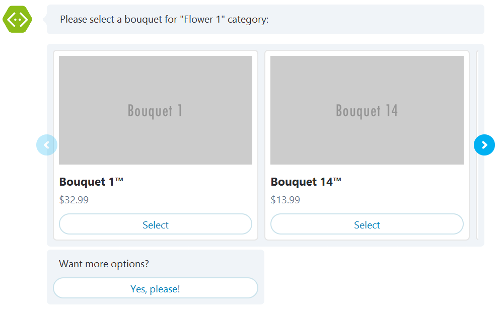|

> You can also see a full sample bot sending multiple rich card attachments in a single message using the Carousel layout in the [Carousel of Cards Bot Sample](../cards-CarouselCards).

#### Complex Forms

Handling a guided conversation like ordering a bouquet of flowers for your loved one can require a lot of effort. In order to simplify building guided conversations, the Bot Framework provides [Waterfall dialogs](https://docs.microsoft.com/en-us/bot-framework/nodejs/bot-builder-nodejs-dialog-waterfall) that let you collect input from a user using a sequence of steps. A bot is always in a state of providing a user with information or asking a question and then waiting for input. In the Node version of Bot Builder its waterfalls that drive this back and forth flow.

Paired with the built-in Prompts you can easily prompt the user with a series of questions:

````JavaScript
library.dialog('/', [
    function (session) {
        builder.Prompts.text(session, 'What\'s the recipient\'s first name?');
    },
    function (session, args) {
        session.dialogData.recipientFirstName = args.response;
        builder.Prompts.text(session, 'What\'s the recipient\'s last name?');
    },
    function (session, args) {
        session.dialogData.recipientLastName = args.response;
        session.beginDialog('validators:phonenumber', {
            prompt: 'What\'s the recipient\'s phone number?',
            retryPrompt: 'Oops, that doesn\'t look like a valid number. Try again.',
            maxRetries: Number.MAX_VALUE
        });
    },
    function (session, args) {
        session.dialogData.recipientPhoneNumber = args.response;
        session.beginDialog('validators:notes', {
            prompt: 'What do you want the note to say? (in 200 characters)',
            retryPrompt: 'Oops, the note is max 200 characters. Try again.',
            maxRetries: Number.MAX_VALUE
        });
    },
    function (session, args) {
        session.dialogData.note = args.response;
        // ...
    }
]);
````

| Emulator | Facebook | Skype |
|----------|-------|----------|
|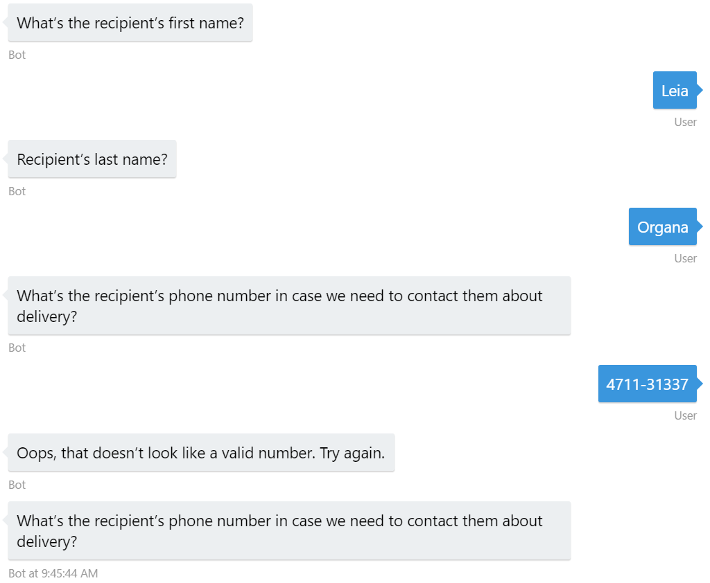|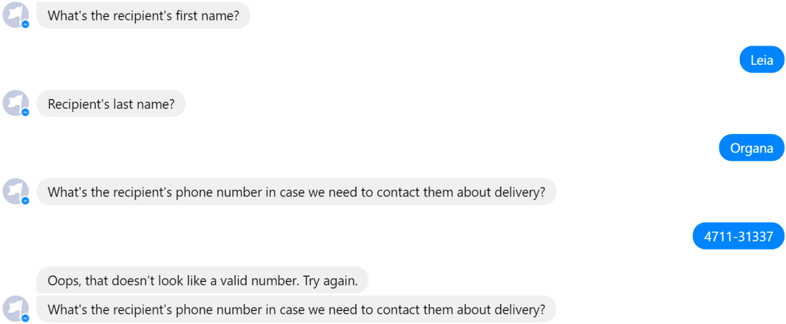|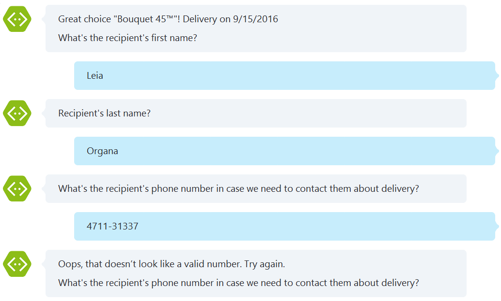|

Bots based on Bot Builder implement something we call *Guided Dialog* meaning that the bot is generally driving (or guiding) the conversation with the user. With waterfalls you drive the conversation by taking an action that moves the waterfall from one step to the next. Calling a built-in prompt like Prompts.text() moves the conversation along because the users response to the prompt is passed to the input of the next waterfall step.

In the previous code sample we're using [session.dialogData](https://docs.botframework.com/en-us/node/builder/chat-reference/classes/_botbuilder_d_.session#dialogdata) to temporarily hold the details information. We do this because when our bot is distributed across multiple compute nodes, every step of the waterfall could be processed by a different compute node. The `dialogData` field ensures that the dialog's state is properly maintained between each turn of the conversation. You can store anything you want into this field but should limit yourself to JavaScript primitives that can be properly serialized.

#### State

Bots built using Bot Builder are designed to be stateless so that they can easily be scaled to run across multiple compute nodes. Because of that you should generally avoid the temptation to save state using a global variable or within a function closure. Doing so will create issues when you want to scale out your bot. Instead leverage the data bags below to persist temporary and permanent state.

Field | Use Cases
-------- | ---------
userData | Stores information globally for the user across all conversations.
conversationData | Stores information globally for a single conversation. This data is visible to everyone within the conversation so care should be used to what's stored there. It's disabled by default and needs to be enabled using the bots [`persistConversationData`](https://docs.botframework.com/en-us/node/builder/chat-reference/interfaces/_botbuilder_d_.iuniversalbotsettings.html#persistconversationdata) setting.
privateConversationData | Stores information globally for a single conversation but its private data for the current user. This data spans all dialogs so it's useful for storing temporary state that you want cleaned up when the conversation ends.
dialogData | Persists information for a single dialog instance. This is essential for storing temporary information in between the steps of a waterfall.

> If you are planning to use `conversationData`, remember to enable conversation data persistence by using the [`persistConversationData`](https://docs.botframework.com/en-us/node/builder/chat-reference/interfaces/_botbuilder_d_.iuniversalbotsettings.html#persistconversationdata) setting flag.

In this sample, the `userData` is used to store and retrieve several user settings, and `dialogData` for saving information between steps of a waterfall dialog.

The [settings dialog](bot/dialogs/settings.js) is used to manage the `userData`.

````JavaScript
switch (option) {
    case SettingChoice.Email:
        var promptMessage = 'Type your email or use (B)ack to return to the menu.';
        if (session.userData.sender && session.userData.sender.email) {
            promptMessage = 'This is your current email: ' + session.userData.sender.email + '.\n\nType a new email if you need to update, or use (B)ack to return to the menu.';
        }
        session.send(promptMessage);
        return session.beginDialog('email');

    case SettingChoice.Phone:
        var promptMessage = 'Type your phone number or use (B)ack to return to the menu.';
        if (session.userData.sender && session.userData.sender.phoneNumber) {
            promptMessage = 'This is your current phone number: ' + session.userData.sender.phoneNumber + '.\n\nType a new number if you need to update, or use (B)ack to return to the menu.';
        }
        session.send(promptMessage);
        return session.beginDialog('phone');
    // ...
}
````
| Emulator | Facebook | Skype |
|----------|-------|----------|
||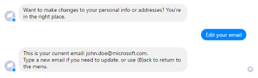|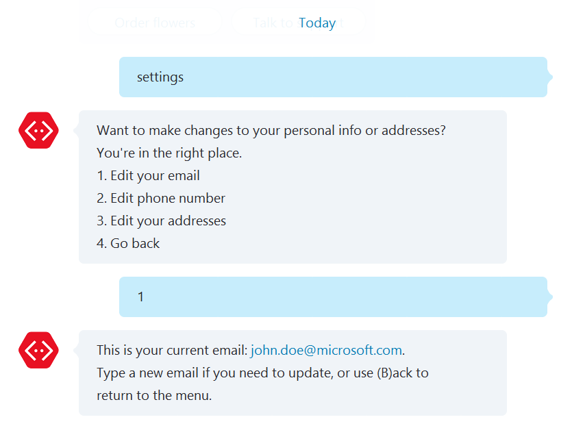|

> You can also see a full sample bot tracking context of a conversation in the [State API Bot Sample](../core-State).

The [shop dialog](bot/dialogs/shop.js) on the other hand, shows how to use `dialogData` to store information about the order and details, within the dialog instance, and then use it in the last step to trigger the checkout process.

````JavaScript
library.dialog('/', [
    function (session) {
        // Ask for delivery address using 'address' library
        session.beginDialog('address:/');
    },
    function (session, args) {
        // Retrieve address, continue to shop
        session.dialogData.recipientAddress = args.address;
        session.beginDialog('product-selection:/');
    },
    function (session, args) {
        // Retrieve selection, continue to delivery date
        session.dialogData.selection = args.selection;
        session.beginDialog('delivery:date');
    },
    //...
    function (session, args) {
        // Continue to checkout
        var order = {
            selection: session.dialogData.selection,
            delivery: {
                date: session.dialogData.deliveryDate,
                address: session.dialogData.recipientAddress
            },
            details: session.dialogData.details,
            billingAddress: session.dialogData.billingAddress
        };

        console.log('order', order);
        session.beginDialog('checkout:/', { order: order });
    }
]);
````

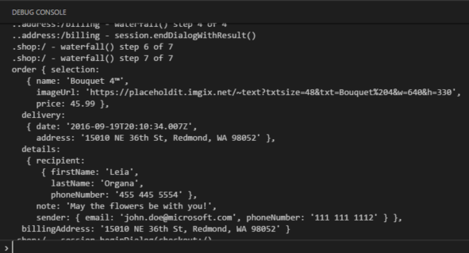

#### Globally Available Commands

Additionally, you'll notice the Settings dialog is globally available, meaning that the user can type `settings` anytime and the settings dialog will be taken on top of the conversation's dialog stack. A piece of [middleware](https://docs.botframework.com/en-us/node/builder/chat-reference/interfaces/_botbuilder_d_.imiddlewaremap.html) inspects every incoming message to see if it contains a specified word and gives the opportunity to manipulate the conversation stack, interrupting the normal dialog flow. Checkout the [middleware](bot/index.js#L61-L80) used to do this.

````JavaScript
// Trigger secondary dialogs when 'settings' or 'support' is called
var settingsRegex = /^settings/i;
var supportRegex = new RegExp('^(talk to support|help)', 'i');
bot.use({
    botbuilder: function (session, next) {
        var text = session.message.text;
        if (settingsRegex.test(text)) {
            // interrupt and trigger 'settings' dialog 
            return session.beginDialog('settings:/');
        } else if (supportRegex.test(text)) {
            // interrupt and trigger 'help' dialog
            return session.beginDialog('help:/');
        }   

        // continue normal flow
        next();
    }
});
````

| Emulator | Facebook | Skype |
|----------|-------|----------|
|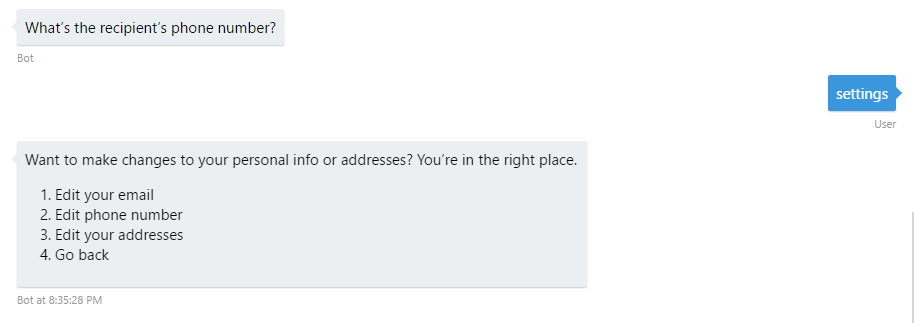|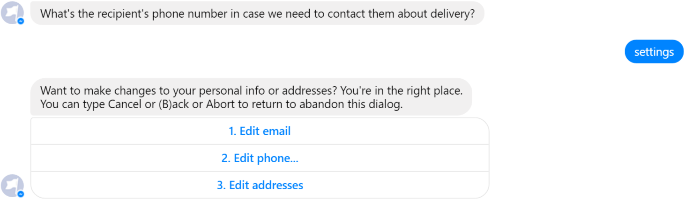|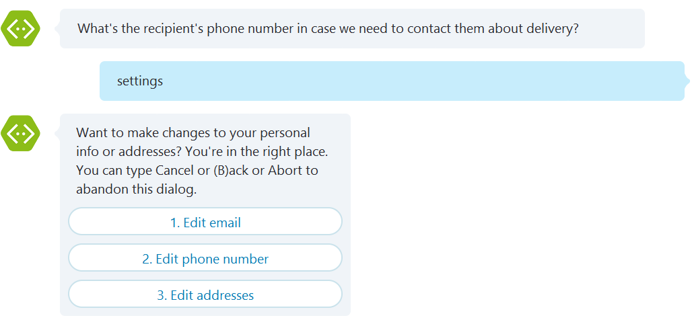|

#### External Events - Resuming Conversations

The exchange of messages between bot and user through a channel (e.g. Facebook Messenger, Skype, Slack) is the primary means of interaction. However, in some scenarios the bot is waiting for an event that occurs in an external component. For example, the passing of time, an external authentication provider (e.g. OAuth scenarios) or an external payment service. In such cases, an [Address](https://docs.botframework.com/en-us/node/builder/chat-reference/interfaces/_botbuilder_d_.iaddress.html) object has the information necessary to resume the conversation.

In this sample, the user proceeds to checkout the order by browsing to an url provided by the bot. This url includes an encoded version of the Address object generated in the [checkout's root dialog](bot/dialogs/checkout.js#L25) using the included [serializeAddress()](bot/utils.js#L28) helper function.

````JavaScript
// Serialize user address
var addressSerialized = botUtils.serializeAddress(session.message.address);

// Create order (with no payment - pending)
orderService.placePendingOrder(order).then(function (order) {

    // Build Checkout url using previously stored Site url
    var checkoutUrl = util.format(
        '%s/checkout?orderId=%s&address=%s',
        siteUrl.retrieve(),
        encodeURIComponent(order.id),
        encodeURIComponent(addressSerialized));

    // ...
});
````

Once the user browses to the checkout page and process the payment, the `Address` included in the url is then decoded (using the [deserializeAddress](bot/utils.js#L28-L30) function) and used to resume the conversation with the bot. You can check [express.js Checkout route](checkout.js) calling the [bot.beginDialog()](checkout.js#L64) function.

> These [helpers methods](bot/utils.js) serialize the address into JSON and then encrypts the string using AES256-CTR to avoid tampering. The inverse process occurs while deserializing the address.

````JavaScript
/* POST Checkout */
router.post('/', function (req, res, next) {
  // orderId and user address
  var orderId = req.body.orderId;
  var address = botUtils.deserializeAddress(req.body.address);

  // Payment information
  var paymentDetails = {
    creditcardNumber: req.body.creditcard,
    creditcardHolder: req.body.fullname
  };

  // Complete order
  orderService.confirmOrder(orderId, paymentDetails).then(function (processedOrder) {

    // Dispatch completion dialog
    bot.beginDialog(address, 'checkout:completed', { orderId: orderId });

    // Show completion
    return res.render('checkout/completed', {
      title: 'Contoso Flowers - Order processed',
      order: processedOrder
    });
  });
});
````

| Emulator | Facebook | Skype |
|----------|-------|----------|
||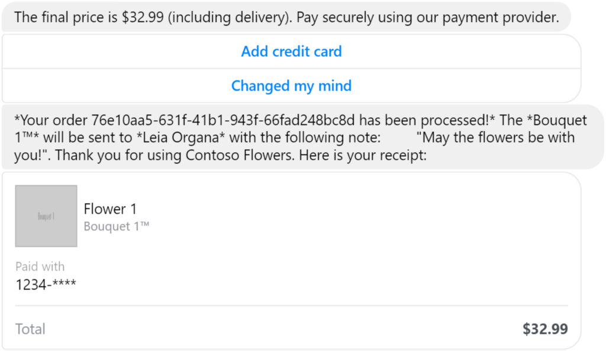||

#### More Advanced Features

While not covered in this sample, it is important to highlight two features that can help tailoring your bot the your specific needs.

If you want to be able to take advantage of special features or concepts for a channel we provide a way for you to send native metadata to that channel giving you much deeper control over how your bot interacts on a channel. The way you do this is to pass extra properties via the [sourceEvent method](https://docs.botframework.com/en-us/node/builder/chat-reference/classes/_botbuilder_d_.message.html#sourceevent).

> You can also see a full sample bot sending native metadata to Facebook using ChannelData in the [ChannelData Bot Sample](../core-ChannelData).

One of the key problems in human-computer interactions is the ability of the computer to understand what a person wants, and to find the pieces of information that are relevant to their intent. In the LUIS application, you will bundle together the intents and entities that are important to your task.

> You can also see a full sample bot using Luis Dialog to integrate with a LUIS.ai application in the [LUIS Bot Sample](../intelligence-LUIS).

#### Localization

Bot Builder includes a [rich localization system](https://docs.microsoft.com/en-us/bot-framework/nodejs/bot-builder-nodejs-localization) for building bots that can communicate with the user in multiple languages. All of your bots prompts can be localized using JSON files stored in your bots directory structure and if you're using a system like [LUIS](https://luis.ai/) to perform natural language processing you can configure your [LuisRecognizer](https://docs.botframework.com/en-us/node/builder/chat-reference/classes/_botbuilder_d_.luisrecognizer) with a separate model for each language your bot supports and the SDK will automatically select the model matching the users preferred locale.

The SDK provides a [session.preferredLocale()](https://docs.botframework.com/en-us/node/builder/chat-reference/classes/_botbuilder_d_.session#preferredlocale) method to both save and retrieve this preference on a per user basis. The SDK also provides a way to configure the default bot's locale:

````JavaScript
// Set default locale
bot.set('localizerSettings', {
    botLocalePath: './bot/locale',
    defaultLocale: 'en'
});
````

The default localization system for Bot Builder is file based and lets a bot support multiple languages using JSON files stored on disk. By default, the localization system will search for the bots prompts in the ./locale/[IETF TAG]/index.json file where [IETF TAG] is a valid [IETF language tag](https://en.wikipedia.org/wiki/IETF_language_tag) representing the preferred locale to use the prompts for. 

You can see in the previous code snippet that we are providing a locale path to inform the SDK where to look for language files. Each file in [the locale folder](bot/locale/en) corresponds to a another file in the [bot's dialogs folder](bot/dialogs). They contain the resource strings used by each dialog. E.g.:

````JavaScript
// bot/locale/en/index.js
{
    "welcome_title": "Welcome to the Contoso Flowers",
    "welcome_subtitle": "These are the flowers you are looking for!",
    "contoso_flowers": "Contoso Flowers",
    "main_options_order_flowers": "Order flowers",
    "main_options_talk_to_support": "Talk to support",
    "main_options_settings": "Settings",
    "help": "Help",
    "thank_you": "Support will contact you shortly. Have a nice day :)"
}
````

##### Leveraging the SDK to localize text automatically

Send text:

````JavaScript
bot.dialog('/', function (session) {
    session.send('welcome_title');              // Will print "Welcome to the Contoso Flowers"
    session.send('welcome_subtitle');           // Will print "These are the flowers you are looking for!"
});
````

Send a card:

````JavaScript
var welcomeCard = new builder.HeroCard(session)
    .title('welcome_title')
    .subtitle('welcome_subtitle')
    .images([
        new builder.CardImage(session)
            .url('https://placeholdit.imgix.net/~text?txtsize=56&txt=Contoso%20Flowers&w=640&h=330')
            .alt('contoso_flowers')
    ]);

session.send(new builder.Message(session)
    .addAttachment(welcomeCard));
````

Internally, the SDK will call `session.preferredLocale()` to get the users preferred locale and will then use that in a call to `session.localizer.gettext()` to map the message ID to its localized text string. There are times where you may need to manually call the localizer.

##### Using the SDK to manually localize text

You can also localize content by using [session.gettext() method](https://docs.botframework.com/en-us/node/builder/chat-reference/classes/_botbuilder_d_.session.html#gettext) which returns a localized string using the session's preferred locale. This same method also supports template strings, where placeholders are replaced with the other arguments passed to the method. E.g:

````JavaScript
// bot/locale/en/checkout.json
{
    "final_price": "The final price is $%d (including delivery). Pay securely using our payment provider.",
}

// bot/dialogs/checkout.js#L37
var messageText = session.gettext('final_price', order.selection.price);
var card = new builder.HeroCard(session)
    .text(messageText);
````

### More Information

To get more information about how to get started in Bot Builder for Node review the following resources:

* [Dialogs](https://docs.microsoft.com/en-us/bot-framework/nodejs/bot-builder-nodejs-dialog-manage-conversation)
* [Dialog Stack](https://docs.microsoft.com/en-us/bot-framework/nodejs/bot-builder-nodejs-dialog-manage-conversation#dialog-stack)
* [Prompt users for input](https://docs.microsoft.com/en-us/bot-framework/nodejs/bot-builder-nodejs-dialog-prompt)
* [Adding Dialogs and Memory](https://docs.botframework.com/en-us/node/builder/guides/core-concepts/#adding-dialogs-and-memory)
* [Collecting Input](https://docs.botframework.com/en-us/node/builder/guides/core-concepts/#collecting-input)
* [Attachments, Cards and Actions](https://docs.botframework.com/en-us/node/builder/chat-reference/interfaces/_botbuilder_d_.iattachment.html)
* [Bot Libraries](https://docs.botframework.com/en-us/node/builder/chat-reference/classes/_botbuilder_d_.library)
* [Localization](https://docs.microsoft.com/en-us/bot-framework/nodejs/bot-builder-nodejs-localization)
* [Custom Channel Capabilities](https://docs.botframework.com/en-us/csharp/builder/sdkreference/channels.html)
* [LUIS](https://docs.botframework.com/en-us/node/builder/guides/understanding-natural-language/)


> **Limitations**  
> The functionality provided by the Bot Framework Activity can be used across many channels. Moreover, some special channel features can be unleashed using the [Message.sourceEvent](https://docs.botframework.com/en-us/node/builder/chat-reference/classes/_botbuilder_d_.message.html#sourceevent) method.
> 
> The Bot Framework does its best to support the reuse of your Bot in as many channels as you want. However, due to the very nature of some of these channels, some features are not fully portable.
> 
> The features used in this sample are fully supported in the following channels:
> - Skype
> - Facebook
> - Slack
> - DirectLine
> - WebChat
> - GroupMe
> 
> They are also supported, with some limitations, in the following channel:
> - Microsoft Teams (Receipt card not supported)
> - Email
> 
> On the other hand, they are not supported and the sample won't work as expected in the following channels:
> - Telegram
> - SMS
> - Kik
